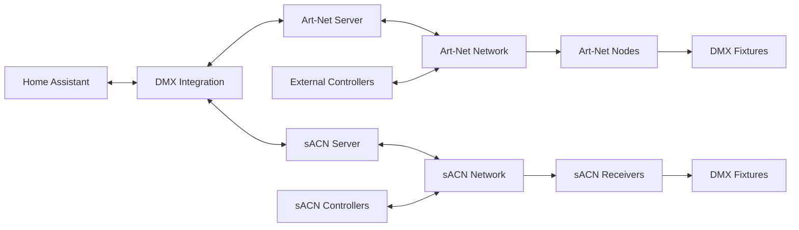

# Art-net LED Lighting for DMX

[](https://github.com/hacs/integration)


[](https://breina.github.io/ha-artnet-led/?label=Docs)

A Home Assistant integration that transforms your instance into a professional Art-Net and sACN lighting controller. Control DMX fixtures, LED strips, and stage lighting directly from Home Assistant with full bidirectional communication using both Art-Net and sACN (E1.31) protocols.


## Features

- **Dual Protocol Support** - Both Art-Net and sACN (E1.31) protocols supported
- **Software Art-Net Controller** - Turn Home Assistant into a fully functional Art-Net node
- **Professional sACN Streaming** - ANSI E1.31-2016 compliant sACN implementation
- **OpenFixtureLibrary Integration** - Use industry-standard fixture definitions
- **Bidirectional Communication** - Send commands and receive updates from controllers
- **Multiple Universe Support** - Control multiple universes with flexible addressing
- **Professional Fixture Support** - RGB, RGBW, moving lights, dimmers, and more
- **Network Auto-Discovery** - Automatic Art-Net node discovery via ArtPoll/ArtPollReply
- **Unicast/Multicast Support** - sACN multicast with optional unicast fallback

## Quick Start

### Installation

1. Install via HACS as a custom repository:
   - Add `https://github.com/Breina/ha-artnet-led` as a custom repository
   - Search for "Art-net LED Lighting for DMX"
   - Install and restart Home Assistant

2. Download fixture definitions from [Open Fixture Library](https://open-fixture-library.org/)
3. Place fixture JSON files in `config/fixtures/`
4. Configure your setup in `configuration.yaml`

### Basic Configuration

```yaml
dmx:
  fixtures:
    folder: fixtures
    
  # Use both protocols simultaneously
  artnet:
    universes:
      - 0:
          devices:
            - Living Room Strip:
                start_address: 1
                fixture: generic-rgb
                mode: 3ch

  sacn:
    source_name: "Home Assistant sACN"
    priority: 100
    universes:
      - 1:
          devices:
            - RGB Strip sACN:
                start_address: 1
                fixture: generic-rgb
                mode: 3ch
          compatibility:
            unicast_addresses:
              - { host: 192.168.1.20 }
```

## Documentation

📖 **[Complete Documentation](https://breina.github.io/ha-artnet-led/)**

- [Configuration Guide](https://breina.github.io/ha-artnet-led/config/) - Detailed setup instructions
- [Art-Net controller overview](https://breina.github.io/ha-artnet-led/artnet-controller-communication/) - Information on how to the integrated Art-Net controller works

## Works Great With

- **[Adaptive Lighting](https://github.com/basnijholt/adaptive-lighting)** - Automatic color temperature adjustment
- **[Emulated Hue](https://github.com/hass-emulated-hue/core)** - Real-time ambilight effects to Art-Net fixtures

## Architecture



## Support

- 🐛 **Issues**: [GitHub Issues](https://github.com/Breina/ha-artnet-led/issues)
- 📖 **Documentation**: [GitHub Pages](https://breina.github.io/ha-artnet-led/)
- 💬 **Discussions**: [Home Assistant community](https://community.home-assistant.io/t/dmx-lighting/2248)

## Contributing

Contributions are welcome! Please read our [contributing guidelines](CONTRIBUTING.md) and submit pull requests for any improvements.

## License

This project is licensed under the GPLv3 license - see the [LICENSE](LICENSE) file for details.

---

*Art-Net™ Designed by and Copyright Artistic Licence*