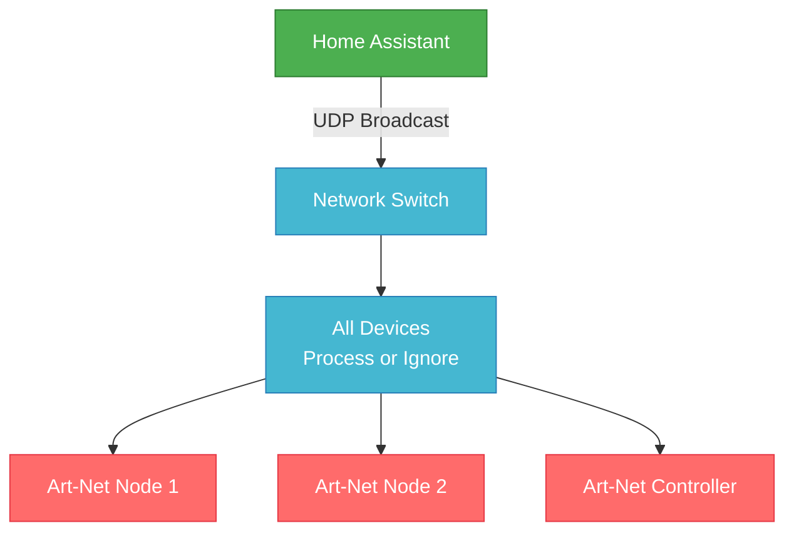
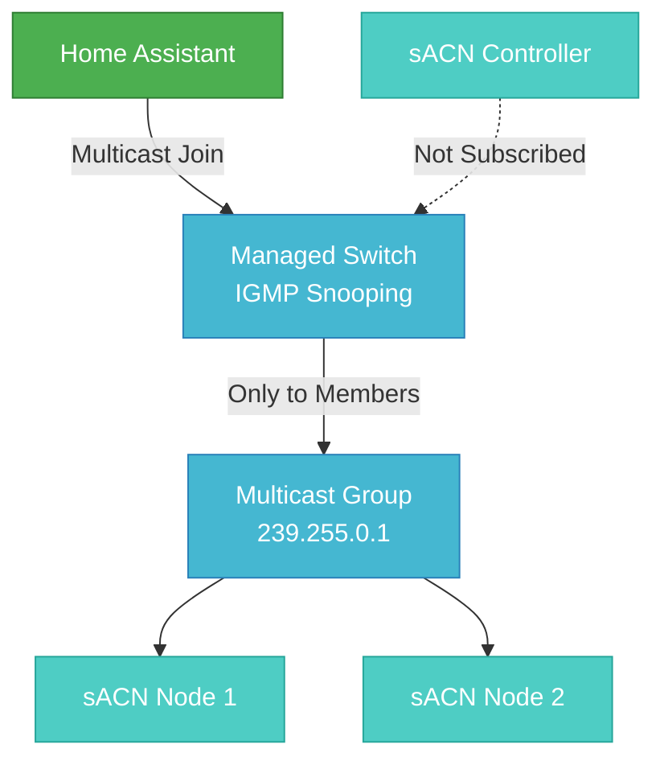

# Art-Net vs sACN: Choosing the Right Protocol

Both Art-Net and sACN are professional lighting control protocols, but they serve different purposes and excel in different scenarios. This guide helps you choose the best protocol for your setup.

**Standards Background:**
- **Art-Net** - Proprietary protocol by Artistic Licence, widely adopted industry standard
- **sACN** - **ANSI E1.31** official standard by Entertainment Services and Technology Association (ESTA)

## Quick Decision Matrix

| **Use Case** | **Recommended Protocol** | **Why** |
|--------------|-------------------------|---------|
| Home theater / residential | **Art-Net** | Simpler setup, works on any network |
| DJ booth / mobile setup | **Art-Net** | Plug-and-play, broadcast discovery, trigger events |
| Nightclub / permanent venue | **sACN** | Professional standard, efficient multicast |
| Large installations (50+ fixtures) | **sACN** | Better network efficiency, priority system |
| Mixed vendor environment | **Art-Net** | Universal compatibility |
| Professional theater | **sACN** | Industry standard, synchronization features |

## Protocol Comparison

### Network Transport

**Art-Net:**
- Uses UDP **broadcast** (`255.255.255.255`) or **unicast**
- Port 6454
- Simple broadcast means all devices see all traffic
- Works on any standard Ethernet network

**sACN:**
- Uses IP **multicast** (`239.255.x.y`) or **unicast** fallback
- Port 5568  
- Efficient: only interested receivers get the data
- Requires multicast-capable network infrastructure

#### Art-Net Broadcast Network



#### sACN Multicast Network



### Universe Addressing

**Art-Net:**
- Universe range: 0-32,767 (but practically 0-511 per subnet)
- Uses Net/Subnet/Universe addressing (e.g., `1/2/0`)
- 15-bit universe addressing within 4-bit net/subnet structure

**sACN:**
- Universe range: 1-63,999
- Simple integer universe IDs (e.g., Universe 1, Universe 42, Universe 5000)
- No subnet limitations

### Multi-Controller Support

**Art-Net:**
- **HTP (Highest Takes Precedence)** or **LTP (Latest Takes Precedence)** merge at receiver level
- **ArtTrigger system** - Send trigger messages mapped to Home Assistant events
- Manual configuration required for controller coordination
- No automatic failover

**sACN:**
- **Built-in priority system** (0-200, higher wins)
- **Automatic failover** when higher-priority source disappears
- **Per-universe priority** and **per-address priority** support


### Synchronization

**sACN:**
- **Built-in synchronization** via sync universe
- All receivers can wait for sync signal before applying data
- **Frame-accurate timing** for complex effects

**Art-Net:**
- **ArtSync** packets for universe synchronization
- Optional feature, not widely implemented
- Manual timing coordination

!!! note "ArtSync Not Implemented"
    ArtSync is not currently implemented in this integration. If you need universe synchronization, please [create a GitHub issue](https://github.com/Breina/ha-artnet-led/issues) to request this feature.

## Network Requirements Comparison

### Art-Net Network Needs

✅ **Advantages:**

- Works on **any** standard Ethernet network
- No special router/switch configuration needed
- WiFi friendly (broadcast works everywhere)
- Zero network administration required

⚠️ **Limitations:**

- Broadcast traffic affects all network devices
- Can overwhelm networks with many universes  
- No built-in traffic optimization

### sACN Network Needs  

✅ **Advantages:**

- **Multicast efficiency** - only subscribers receive data
- Scales well to large installations
- Professional network optimization

⚠️ **Requirements:**

- **Managed switches** with IGMP snooping
- **Multicast-capable routers**
- **WiFi multicast forwarding** enabled
- Network administration knowledge helpful

!!! warning "Home Network Reality Check"
    Many home routers and "smart" switches disable or poorly handle multicast. Art-Net's broadcast approach "just works" on consumer equipment, while sACN may require network configuration or unicast fallback.

## Installation Scenarios

### Scenario 1: Home Theater Setup

**Setup:** Living room with RGB LED strips, smart switches, couple of moving heads

**Recommendation: Art-Net**

Why Art-Net wins:
- Simple setup with consumer network equipment
- Few devices, so broadcast traffic is minimal  
- Easy troubleshooting with standard tools
- Broader device compatibility
- ArtTrigger events for Home Assistant automation integration

```yaml
dmx:
  artnet:
    universes:
      - 0:
          devices:
            - TV Backlight:
                fixture: generic-rgb
                start_address: 1
            - Ceiling Spots:
                fixture: generic-rgbw  
                start_address: 10
```

### Scenario 2: Nightclub Installation

**Setup:** 200+ LED fixtures, multiple lighting consoles, backup systems required

**Recommendation: sACN**

Why sACN wins:
- Multicast efficiency with hundreds of fixtures
- Priority system for console backup/override
- Professional standard expected by lighting techs
- Synchronization for tight visual effects

```yaml
dmx:
  sacn:
    source_name: "Main Lighting Controller"
    priority: 100
    sync_address: 7000
    
    universes:
      - 1:   # DJ Booth RGB
      - 2:   # Dance Floor Wash
      - 3:   # Moving Heads
      - 4:   # LED Wall
      # ... up to universe 50+
```

### Scenario 3: Mixed Professional Environment

**Setup:** Permanent installation with mix of old Art-Net gear and new sACN equipment

**Recommendation: Both Protocols**

Run simultaneously on different universes:

```yaml
dmx:
  # Legacy equipment on Art-Net
  artnet:
    universes:
      - 0:   # Old dimmer racks
      - 1:   # Legacy LED controllers
  
  # New equipment on sACN  
  sacn:
    universes:
      - 10:  # Modern LED fixtures
      - 11:  # New moving lights
```

## Future Considerations

**sACN Adoption:**

- New professional equipment primarily sACN
- Lighting console manufacturers prioritize sACN development  
- ANSI standard updates continue (E1.31-2018, etc.)

**Art-Net Persistence:**

- Still dominant in retrofit and home installations
- Art-Net 4 adds some sACN-like features
- Broad compatibility ensures continued use

**RDMnet Evolution:**

- Built on sACN foundation
- Bi-directional communication for device management
- Future of professional lighting control

The choice between Art-Net and sACN ultimately depends on your specific installation requirements, network capabilities, and long-term maintenance considerations.

---

*Art-Net™ Designed by and Copyright Artistic Licence*