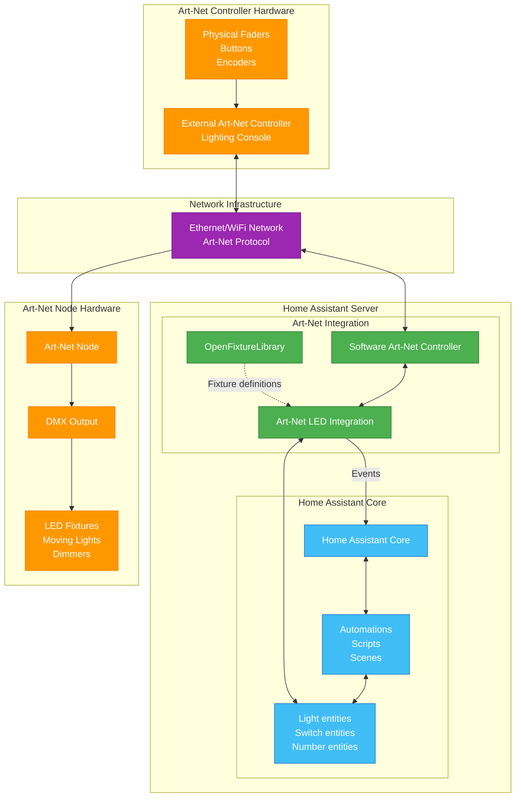

# Art-net LED Lighting for DMX

A comprehensive Home Assistant integration that transforms your smart home into a professional lighting control system using Art-Net and DMX protocols.

## What is this integration?

This integration creates a software-based Art-Net controller within Home Assistant, allowing you to control professional lighting fixtures, LED strips, and stage equipment directly from your smart home platform. Whether you're setting up architectural lighting, home theater ambiance, or stage lighting effects, this integration bridges the gap between consumer smart home technology and professional lighting control.

## What You Get

Once configured, the integration creates Home Assistant entities for each fixture and channel:

*Example: Configured fixtures appear as standard Home Assistant entities with full control capabilities*

## Key Features

### Art-Net Controller
- **Software-based Art-Net controller** - Turn your Home Assistant instance into a functional Art-Net controller
- **Universe management** - Control multiple Art-Net universes with flexible addressing
- **Bi-directional communication** - Send commands to other Art-Net devices and receive universe updates from other controllers
- **Auto-discovery** - Announces itself to other Art-Net devices on your network

### Professional Fixture Support
- **[OpenFixtureLibrary](https://open-fixture-library.org/) integration** - Use industry-standard fixture definitions for accurate control
- **Multi-mode fixtures** - Support for fixtures with different channel modes (8-bit, 16-bit, RGB, RGBW, etc.)
- **Flexible addressing** - Configure start addresses and channel mappings per fixture
- **Multiple fixture types** - From simple LED strips to complex moving lights

### Network Protocols
- **Art-Net** - Primary protocol support with full universe control
- **sACN (E1.31)** - Streaming ACN support for modern lighting networks *(coming soon)*

## How it works

1. Install through HACS as "Art-net LED Lighting for DMX"
2. Place OpenFixtureLibrary JSON files in your configured fixtures folder
3. Define universes, devices, and addressing in Home Assistant configuration
4. Control fixtures through standard Home Assistant entities and automations

## Works well with

- **[Adaptive Lighting integration](https://github.com/basnijholt/adaptive-lighting)** - Automatically adjusts color temperature to match the sun's position throughout the day
- **[Emulated HUE Add-On](https://github.com/hass-emulated-hue/core)** - Mimics a Hue controller to send real-time lighting data to Art-Net fixtures (e.g., TV ambilight effects to RGBW strips)

## Community

[Home Assistant community](https://community.home-assistant.io/t/dmx-lighting/2248)

## Getting Started

Ready to transform your lighting setup? Head over to the [Configuration](config.md) section to learn how to set up your first Art-Net universe and fixtures.

---

*Art-Net™ Designed by and Copyright Artistic Licence*

*This integration brings professional lighting control capabilities to Home Assistant, making it easy to create stunning lighting effects and integrate them with your existing smart home automation.*