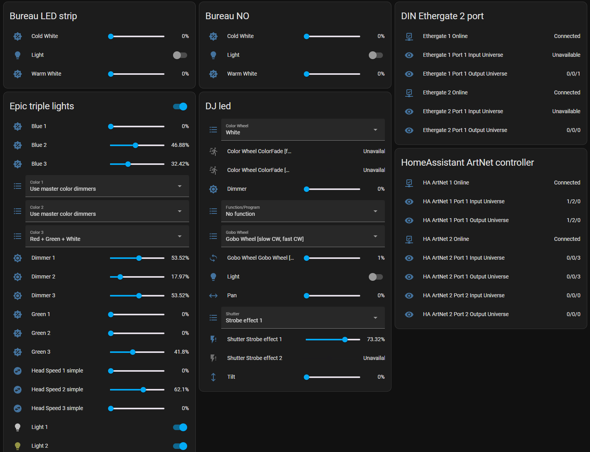
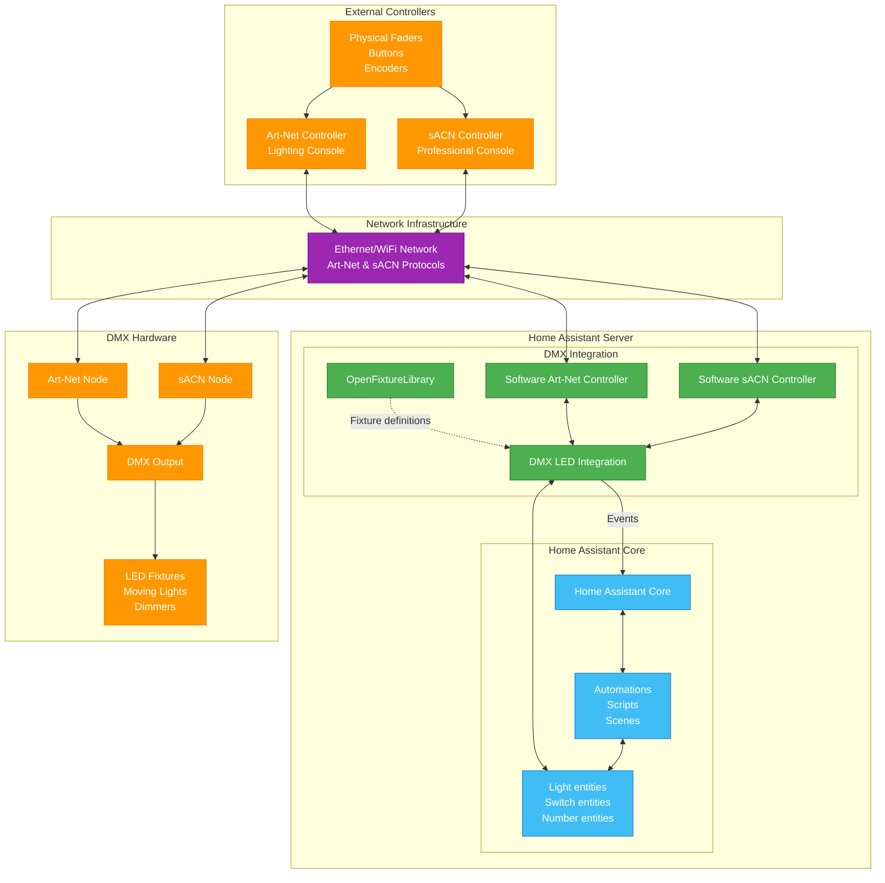

# Art-Net & sACN LED Lighting for DMX

A comprehensive Home Assistant integration that transforms your smart home into a professional lighting control system using both Art-Net and sACN (E1.31) protocols.

## What is this integration?

This integration creates software-based Art-Net and sACN controllers within Home Assistant, allowing you to control professional lighting fixtures, LED strips, and stage equipment directly from your smart home platform. Whether you're setting up residential lighting, home theater ambiance, nightclub installations, or professional stage lighting, this integration bridges the gap between consumer smart home technology and professional lighting control protocols.

## What You Get

Once configured, the integration creates Home Assistant entities for each fixture and channel:

*Example: Configured fixtures appear as standard Home Assistant entities with full control capabilities*

## Key Features

### Dual Protocol Support
- **Art-Net Controller** - Software-based Art-Net controller with bi-directional communication and auto-discovery
- **sACN (E1.31) Streaming** - ANSI E1.31-2016 compliant sACN implementation with multicast and unicast support
- **Universe Management** - Control multiple universes across both protocols with flexible addressing
- **Priority System** - sACN priority handling for professional multi-controller setups
- **Network Efficiency** - Art-Net broadcast for simplicity, sACN multicast for large installations

### Professional Fixture Support
- **[OpenFixtureLibrary](https://open-fixture-library.org/) integration** - Use industry-standard fixture definitions for accurate control
- **Multi-mode fixtures** - Support for fixtures with different channel modes (8-bit, 16-bit, RGB, RGBW, etc.)
- **Flexible addressing** - Configure start addresses and channel mappings per fixture
- **Multiple fixture types** - From simple LED strips to complex moving lights

### Network Protocols
- **Art-Net** - Primary protocol support with full universe control and bidirectional communication
- **sACN (E1.31)** - ANSI E1.31-2016 compliant Streaming ACN support with multicast and unicast transmission

## How it works

1. Install through HACS as "Art-net LED Lighting for DMX"
2. Place OpenFixtureLibrary JSON files in your configured fixtures folder
3. Define universes, devices, and addressing in Home Assistant configuration
4. Control fixtures through standard Home Assistant entities and automations

## Works well with

- **[Adaptive Lighting integration](https://github.com/basnijholt/adaptive-lighting)** - Automatically adjusts color temperature to match the sun's position throughout the day
- **[Emulated HUE Add-On](https://github.com/hass-emulated-hue/core)** - Mimics a Hue controller to send real-time lighting data to Art-Net fixtures (e.g., TV ambilight effects to RGBW strips)

## Community

[Home Assistant community](https://community.home-assistant.io/t/dmx-lighting/2248)

## Getting Started

Ready to transform your lighting setup? 

1. **Choose Your Protocol** - Read our [Art-Net vs sACN](artnet-vs-sacn.md) guide to decide which protocol suits your needs
2. **Configure Your Setup** - Follow the [Configuration](config.md) guide to set up your universes and fixtures
3. **Learn Advanced Features** - Explore [Art-Net Communication](artnet-controller-communication.md) and [External sACN Controller](sacn-communication.md) for professional setups

---

*Art-Net™ Designed by and Copyright Artistic Licence*

*This integration brings professional lighting control capabilities to Home Assistant, making it easy to create stunning lighting effects and integrate them with your existing smart home automation.*