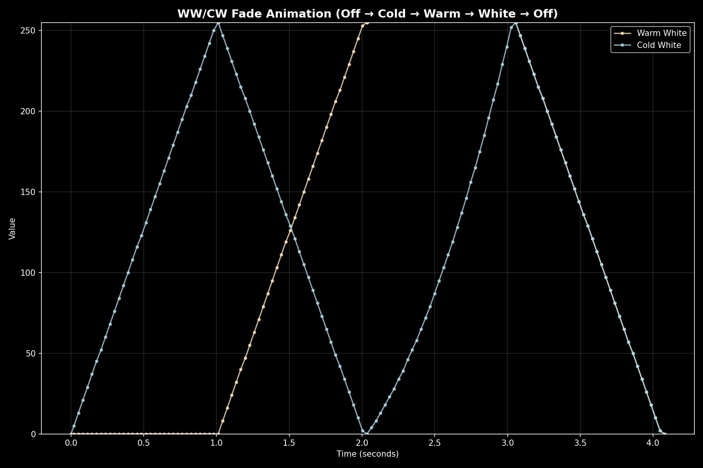
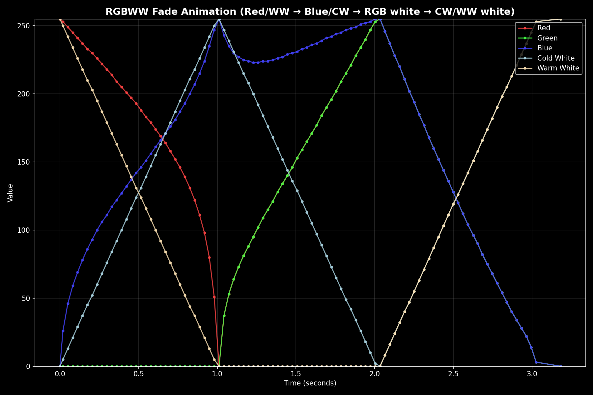

# Light Transitions with L\*U\*V\* Color Space

The DMX integration provides professional-grade smooth color transitions using perceptually uniform color space interpolation. This ensures that color changes appear natural and consistent to human vision.

## Quick Start

Add a `transition` parameter to any light service call to enable smooth animations:

```yaml
# Fade to red over 5 seconds
action: light.turn_on
target:
  entity_id: light.my_dmx_fixture
data:
  rgb_color: [255, 0, 0]
  transition: 5

# Adjust brightness smoothly over 2 seconds  
action: light.turn_on
target:
  entity_id: light.my_dmx_fixture
data:
  brightness_pct: 50
  transition: 2

# Change color temperature with 10-second transition
action: light.turn_on
target:
  entity_id: light.my_dmx_fixture
data:
  color_temp_kelvin: 2700
  transition: 10
```

## Supported Fixture Types

Transitions work with all fixture color modes:

- **RGB**: Smooth color transitions through L\*U\*V\* color space
- **RGBW**: RGB channels use L\*U\*V\*, white channel uses linear interpolation  
- **RGBWW**: RGB channels use L\*U\*V\*, white channels use linear interpolation
- **Color Temperature**: Direct brightness and temperature interpolation
- **CW/WW**: Color temperature and brightness interpolation

## Why L\*U\*V\* Color Space?

Traditional RGB interpolation creates unnatural color transitions that don't match how humans perceive color changes. Our implementation uses **L\*U\*V\* (CIELUV)** color space for perceptually uniform transitions.

### The Problem with RGB Interpolation

When transitioning from red to green in RGB space:

- **RGB values**: (255, 0, 0) → (0, 255, 0)  
- **Perceived path**: Red → Brown/Yellow → Green
- **Visual result**: Unnatural, muddy intermediate colors

### The L\*U\*V\* Solution  

L\*U\*V\* color space is designed for perceptual uniformity:

- **L\* (Lightness)**: Matches human brightness perception
- **u\* and v\* (Chromaticity)**: Uniform color differences
- **Interpolation result**: Smooth, natural color transitions

## Animation Behavior

### RGB Color Changes
Color transitions use L\*U\*V\* interpolation for smooth, natural color paths:


*RGB transitions through L\*U\*V\* color space create smooth color paths*

### White Light Control  
Color temperature and white channel changes use direct interpolation:



*Warm/cold white transitions interpolate temperature and brightness*

### Mixed RGBWW Fixtures
RGB and white channels are handled separately to maintain color accuracy:



*RGBWW fixtures transition RGB through L\*U\*V\* while white channels interpolate directly*
